# Introduction

The R package `qtlpoly` (v. 0.2.4) [@Pereira2020] is an under development software to map multiple quantitative trait loci (QTL) in full-sib families of outcrossing autopolyploid species. It is based on the following random-effect model:

$$\boldsymbol{y} = \boldsymbol{1}\mu + \sum_{q=1}^Q \boldsymbol{g}_q + \boldsymbol{e}$$

where the vector of phenotypic values from a specific trait $\boldsymbol{y}$ is a function of the fixed intercept $\mu$, the $q = 1, \dots, Q$ random QTL effects $\boldsymbol{g}_q \sim \mathcal{N}(\boldsymbol{0}, \boldsymbol{G}_q\sigma^2_q)$, and the random environmental error $\boldsymbol{e} \sim \mathcal{N}(\boldsymbol{0}, \boldsymbol{I}\sigma^2)$. $\boldsymbol{G}_q$ is the additive relationship matrix between full-sibs derived from the genotype conditional probabilities of QTL $q$. See model details in @Pereira2020.

Variance components associated with putative QTL ($\sigma^2_q$) are tested using score statistics, as proposed in @Qu2013. Final models are fitted using residual maximum likelihood (REML) from the R package `sommer` (v. 4.1) [@Covarrubias-Pazaran2016]. Plots for visualizing the results are based on `ggplot2` (v. 3.1.0) [@Wickham2016]. 

This tutorial used R version 4.2.2 Patched (2022-11-10 r83330) running on Ubuntu 20.04 LTS (64-bit).

## Install and load the `qtlpoly` package and data

`qtlpoly` package is available in its stable version on [CRAN](https://cran.r-project.org/package=qtlpoly) and an under-development version at [GitHub](https://github.com/gabrielgesteira/qtlpoly). You can install the stable version from CRAN by running:


```r
> install.packages("qtlpoly")
```

To use the development version, please run the following commands to install `qtlpoly` and all of its dependencies:


```r
> ## install.packages('devtools')
> devtools::install_github("gabrielgesteira/qtlpoly")
```

Then, use the function `library()` -- or `require()` -- to load the package: 


```r
> library(qtlpoly)
```

`qtlpoly` includes preloaded datasets that are simpler, so one can run the functions along with this tutorial using a regular personal computer (with 4 cores and 6 GB of RAM, minimum). For real data analyses, one may need to run an R script in a cluster with more cores and RAM. In general, the computational needs depend on ploidy level, population size, and the number of markers.

The dataset used in this tutorial was based on a full-sib family ($N = 156$) from a biparental potato population. You can view the maps with `mappoly` after installing it: 


```r
> ## install.packages('mappoly')
> library(mappoly)
## Warning in fun(libname, pkgname): couldn't connect to display ":0"
## =====================================================
## MAPpoly Package [Version 0.3.22022-12-02 08:00:02 UTC]
## More information: https://github.com/mmollina/MAPpoly
## =====================================================
> plot_map_list(maps4x)
```

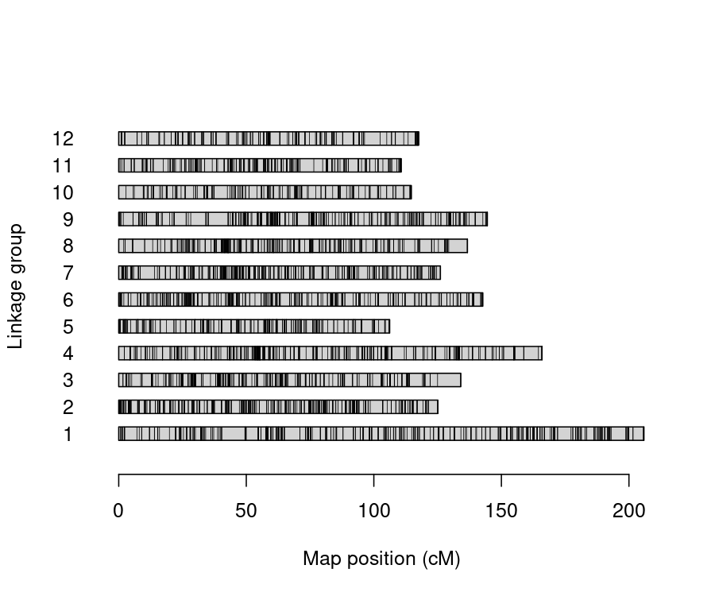

```r
> plot(maps4x[[1]])
```

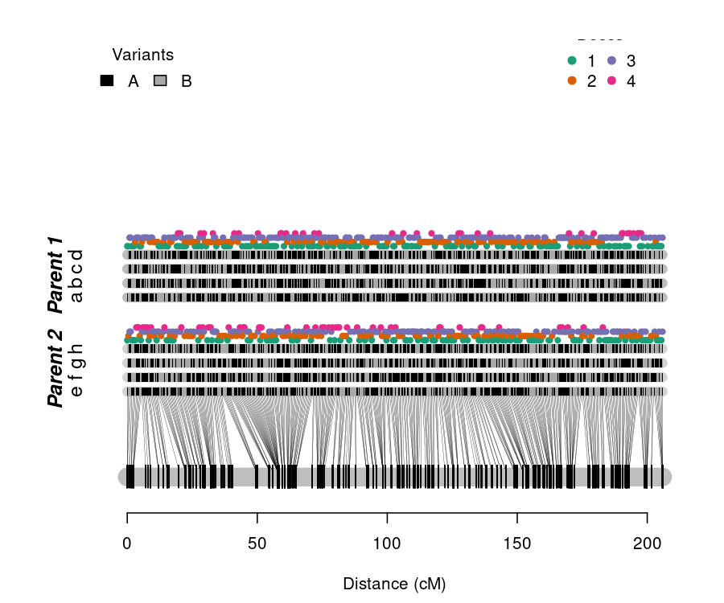

```r
> summary_maps(maps4x)
## 
## Your dataset contains removed (redundant) markers. Once finished the maps, remember to add them back with the function 'update_map'.
##       LG Genomic sequence Map length (cM) Markers/cM Simplex Double-simplex
## 1      1                1          205.88       2.31     102            122
## 2      2                2          125.11       3.44     131            139
## 3      3                3          134.07       2.85     151             21
## 4      4                4           165.9       2.56     114             87
## 5      5                5           106.2       2.93     124             53
## 6      6                6           142.7       2.78      73             75
## 7      7                7          126.09       3.28     136             94
## 8      8                8          136.68        2.5      61             98
## 9      9                9          144.49       2.46      76            101
## 10    10               10          114.67       1.81      47             36
## 11    11               11          110.66       2.89      95             52
## 12    12               12          117.54       1.91     115             32
## 13 Total             <NA>         1629.99       2.64    1225            910
##    Multiplex Total Max gap
## 1        252   476    9.01
## 2        160   430     4.9
## 3        210   382    9.09
## 4        224   425    5.74
## 5        134   311    4.22
## 6        249   397    3.83
## 7        184   414    5.65
## 8        183   342    7.32
## 9        179   356    7.79
## 10       124   207    5.27
## 11       173   320    5.41
## 12        78   225    6.09
## 13      2150  4285    6.19
```

The resulting linkage map consists of 12 linkage groups (LGs) with 4,285 markers, spanning 1629.99 centiMorgans (cM) of the potato genome. Please see details on the map construction for this simulated cross using `mappoly` [here](https://rpubs.com/mmollin/tetra_mappoly_vignette). The phenotypic data contains three traits in a simple table, where traits are distributed in columns and individuals in rows. For example:


```r
> head(pheno4x)
##            FM07  FM08  FM14
## B2721.001 75.13 53.63 91.50
## B2721.002 62.25 88.63 89.50
## B2721.003 86.00 82.88 91.50
## B2721.004    NA 61.88 86.63
## B2721.005 51.75 49.25 88.63
## B2721.006 80.63 88.88 88.63
```

# Conditional probabilities

Our `qtlpoly` package is fully integrated with `mappoly` [@Mollinari2019], so if you have a map built using another software, you will need to convert or re-estimate it using functions from `mappoly`. Please refer to its [tutorial](https://github.com/mmollina/MAPpoly) in order to learn more about the software. `mappoly` uses a hidden Markov model (HMM) adapted from @Landert1987 to autopolyploids to estimate the genotype conditional probabilities of putative QTL given an ordered set of markers comprising a linkage map [@Mollinari2019]. These conditional probabilities are ultimately used for QTL mapping by `qtlpoly`.

To compute the conditional probabilities for each linkage group, one should use the function `calc_genoprob()` from `mappoly`:


```r
> library(mappoly)
> genoprob4x = lapply(maps4x, calc_genoprob)
## 	Ploidy level: 4
## 	Number of markers: 476
## 	Number of individuals: 156
## 	..................................................
## 	..................................................
## 	..................................................
## 	......
## 	Ploidy level: 4
## 	Number of markers: 430
## 	Number of individuals: 156
## 	..................................................
## 	..................................................
## 	..................................................
## 	......
## 	Ploidy level: 4
## 	Number of markers: 382
## 	Number of individuals: 156
## 	..................................................
## 	..................................................
## 	..................................................
## 	......
## 	Ploidy level: 4
## 	Number of markers: 425
## 	Number of individuals: 156
## 	..................................................
## 	..................................................
## 	..................................................
## 	......
## 	Ploidy level: 4
## 	Number of markers: 311
## 	Number of individuals: 156
## 	..................................................
## 	..................................................
## 	..................................................
## 	......
## 	Ploidy level: 4
## 	Number of markers: 397
## 	Number of individuals: 156
## 	..................................................
## 	..................................................
## 	..................................................
## 	......
## 	Ploidy level: 4
## 	Number of markers: 414
## 	Number of individuals: 156
## 	..................................................
## 	..................................................
## 	..................................................
## 	......
## 	Ploidy level: 4
## 	Number of markers: 342
## 	Number of individuals: 156
## 	..................................................
## 	..................................................
## 	..................................................
## 	......
## 	Ploidy level: 4
## 	Number of markers: 356
## 	Number of individuals: 156
## 	..................................................
## 	..................................................
## 	..................................................
## 	......
## 	Ploidy level: 4
## 	Number of markers: 207
## 	Number of individuals: 156
## 	..................................................
## 	..................................................
## 	..................................................
## 	......
## 	Ploidy level: 4
## 	Number of markers: 320
## 	Number of individuals: 156
## 	..................................................
## 	..................................................
## 	..................................................
## 	......
## 	Ploidy level: 4
## 	Number of markers: 225
## 	Number of individuals: 156
## 	..................................................
## 	..................................................
## 	..................................................
## 	......
```

# Prepare data

Once the conditional probabilities have been calculated, you can use the function `read_data()` to read both `genoprob4x` and `pheno4x` objects. Row names (individuals) on `pheno4x` must match the individual names from the `genoprob4x` object. The argument `ploidy = 4` informs the ploidy level of the cross, i.e., a tetraploid cross in this case. Finally, `step = 1` provides the step size so that only positions at every 1 cM (approximately) will be tested: 


```r
> data = read_data(ploidy = 4, geno.prob = genoprob4x, pheno = pheno4x, step = 1)
## Reading the following data: 
##   Ploidy level:       4
##   No. individuals:    156
##   No. linkage groups: 12
##   Step size:          1 cM 
##   Map size:           1630.01 cM (1102 positions) 
##   No. phenotypes:     3
```

If you want to see detailed information on the map (number of positions per linkage group) and the phenotypes (number of individuals with non-missing values per trait), use a `print()` function with `detailed = TRUE`:


```r
> print(data, detailed = TRUE)
## This is an object of class 'qtlpoly.data'
##   Ploidy level:       4
##   No. individuals:    156
##   No. linkage groups: 12
##   Step size:          1 cM 
##   Map size:           1630.01 cM (1102 positions) 
##     LG 1: 205.88 cM (123 positions) 
##     LG 2: 125.11 cM (101 positions) 
##     LG 3: 134.07 cM (90 positions) 
##     LG 4: 165.9 cM (106 positions) 
##     LG 5: 106.2 cM (71 positions) 
##     LG 6: 142.7 cM (105 positions) 
##     LG 7: 126.09 cM (96 positions) 
##     LG 8: 136.68 cM (95 positions) 
##     LG 9: 144.49 cM (100 positions) 
##     LG 10: 114.67 cM (67 positions) 
##     LG 11: 110.66 cM (82 positions) 
##     LG 12: 117.54 cM (66 positions) 
##   No. phenotypes:     3
##     Trait 1: 'FM07' (141 individuals) 
##     Trait 2: 'FM08' (143 individuals) 
##     Trait 3: 'FM14' (140 individuals)
```

Notice that regardless of the number of markers per linkage group, we will rather evaluate only a limited number of positions, given the `step` argument (in our example, every 1 cM). Because of the quite large linkage disequilibrium blocks in mapping populations, especially in full-sib families with relatively small sample sizes (let us say, $N < 300$), there is no need to test every single marker in the map. Moreover, with such marker density (e.g., 5+ markers/cM), a lot of markers will contain redundant information for QTL mapping purposes anyway. `step = NULL` will allow to test every single marker in a high density map if one wants to do so, but be sure that computational time (and needed RAM for loading the `qtlpoly.data` object) will be hugely increased.

# Score-based resampling to assess genome-wide significance

Rather than guessing pointwise significance levels for declaring QTL, you can use the score-based resampling method to assess the genome-wide significance level (Zou et al. 2004). This method is relatively intensive, because it involves score statistics computation for every position in the map repeated 1,000 times (resampling):


```r
> ## data.sim = simulate_qtl(data = data, mu = 0, h2.qtl = NULL, var.error =
+ ## 1, n.sim = 1000, missing = TRUE, seed = 123) score.null =
+ ## null_model(data = data.sim$results, n.clusters = 6, plot = NULL)
+ ## min.pvl = unlist(lapply(score.null$results, function(x)
+ ## return(x$pval[which.max(x$stat)]))) quantile(sort(min.pvl), c(0.2,
+ ## 0.05)) 20% 5% 0.0011493379 0.0002284465
```

# Perform QTL detection

Building a multiple QTL model is considered a model selection problem, and there are several ways to approach it. Here, we adapted the algorithm proposed by @Kao1999 for fixed-effect multiple interval mapping (MIM) for diploids to our random-effect MIM (REMIM) for polyploids, which is summarized as follows:

0. Null model: for each trait, a model starts with no QTL
$$\boldsymbol{y} = \boldsymbol{1}\mu + \boldsymbol{e}$$
1. Forward search: QTL ($q = 1, \dots, Q$) are added one at a time, conditional to the one(s) (if any) already in the model, under a less stringent threshold (e.g., $P < 0.01$)
$$\boldsymbol{y} = \boldsymbol{1}\mu + \sum_{q=1}^Q \boldsymbol{g}_q + \boldsymbol{e}$$
2. Model optimization: each QTL $r$ is tested again conditional to the remaining one(s) in the model under a more stringent threshold (e.g., $P < 10^{-4}$)
$$\boldsymbol{y} = \boldsymbol{1}\mu + \boldsymbol{g}_r + \sum_{q \neq r} \boldsymbol{g}_q + \boldsymbol{e}$$
Steps 1 and 2 are repeated until no more QTL can be added to or dropped from the model, and positions of the remaining QTL do not change. After the first model optimization, the following forward searches use the more stringent threshold (e.g., $P < 10^{-4}$) as the detection power is expected to increase once QTL have already been added to the model.
3. QTL profiling: score statistics for the whole genome are updated conditional to the final set of selected QTL.

It is worth to mention that there is no definitive way to perform model selection. One may try to come with alternative ways of building a multiple QTL model, some of which will be mentioned later. `qtlpoly` tries to provide functions flexible enough so that users can build a multiple QTL model on their own, manually. One strategy we have been testing and using implements the above-mentioned algorithm of building a multiple QTL model, which will be demonstrated below.

## Manual search

### 0. Null model

The function `null_mod()` runs the first round of score statistics along the genome for the traits specified by `pheno.col`, which contains a vector of column numbers that one wants to analyze. If `pheno.col = NULL` (the default), all traits in `data` will be analyzed. All the subsequent functions will inherit this set of selected traits:


```r
> null.mod = null_model(data = data, n.clusters = 4)
## INFO: Using 4 CPUs for calculation
## 
## Null model for trait 1 'FM07' 
##   Calculation took 20.49 seconds
## 
## Null model for trait 2 'FM08' 
##   Calculation took 19.61 seconds
## 
## Null model for trait 3 'FM14' 
##   Calculation took 18.58 seconds
```

Progress is shown as `verbose = TRUE` by default. Plots with the logarithm of $P$-value [$LOP = -\log_{10}(P)$] can be generated using the argument `plot`, which is `NULL` by default. Notice that 4 cores are requested for parallel analysis by `n.clusters = 4`, which speeds up the process. 

A `print()` function summarizes any `qtlpoly.model` object containing QTL (if any), including `qtlpoly.null`:


```r
> print(null.mod)
## This is an object of class 'qtlpoly.null'
## 
## * Trait 1 'FM07' 
## There are no QTL in the model 
## 
## * Trait 2 'FM08' 
## There are no QTL in the model 
## 
## * Trait 3 'FM14' 
## There are no QTL in the model
```

### 1. Forward search

Once the first run of score statistics has been carried out, you can start looking for QTL. `w.size = 15` sets a distance of 15 cM on either side of any QTL already in the model where another putative QTL should not be considered due to the linkage disequilibrium. We will assume this window size value to be the same from now on. During the first forward search, it is recommended to use a less stringent significance level such as `sig.fwd = 0.01`, so that more positions are allowed to be tested in the next step. Progress is shown for each QTL included in the model as `verbose = TRUE` by default:


```r
> search.mod = search_qtl(data = data, model = null.mod, w.size = 15, sig.fwd = 0.01,
+     n.clusters = 4)
## INFO: Using 4 CPUs for calculation
## 
## Forward search for trait 1 'FM07'; there are no QTL in the model 
##   QTL was found on LG 5 at 26.19 cM (position number 438)
##   QTL was found on LG 7 at 60.68 cM (position number 641)
##   QTL was found on LG 6 at 47.14 cM (position number 529)
##   No more QTL were found. A putative QTL on LG 1 at 7.12 cM (position number 4) did not reach the threshold; its p-value was 0.02045
##   Calculation took 226.54 seconds
## 
## Forward search for trait 2 'FM08'; there are no QTL in the model 
##   QTL was found on LG 5 at 26.19 cM (position number 438)
##   QTL was found on LG 1 at 7.12 cM (position number 4)
##   QTL was found on LG 7 at 65.13 cM (position number 644)
##   QTL was found on LG 10 at 9.61 cM (position number 892)
##   QTL was found on LG 8 at 18.1 cM (position number 701)
##   QTL was found on LG 6 at 49.48 cM (position number 531)
##   No more QTL were found. A putative QTL on LG 11 at 85.89 cM (position number 1017) did not reach the threshold; its p-value was 0.01051
##   Calculation took 775.17 seconds
## 
## Forward search for trait 3 'FM14'; there are no QTL in the model 
##   QTL was found on LG 5 at 12.09 cM (position number 430)
##   QTL was found on LG 7 at 66.12 cM (position number 645)
##   QTL was found on LG 5 at 44.03 cM (position number 449)
##   QTL was found on LG 2 at 95.98 cM (position number 203)
##   QTL was found on LG 11 at 81.32 cM (position number 1014)
##   No more QTL were found. A putative QTL on LG 12 at 0 cM (position number 1037) did not reach the threshold; its p-value was 0.01534
##   Calculation took 537.86 seconds
```

The last putative QTL position that does not reach the threshold is printed together with its $P$-value. The default `n.rounds = Inf` will let the function run consecutive rounds until no more significant positions are found. One can optionally set `n.rounds = 1` to limit the number of QTL included in the model to only the most significant one. 

A `print()` function summarizes the QTL in the current model:


```r
> print(search.mod)
## This is an object of class 'qtlpoly.search'
## 
## * Trait 1 'FM07' 
##   LG   Pos Nmrk      Mrk  Score      Pval
## 1  5 26.19  438 c2_22986 356.22 <2.22e-16
## 2  7 60.68  641 c2_38643 159.11  2.84e-06
## 3  6 47.14  529 c2_31600  18.65  1.58e-01
## 
## * Trait 2 'FM08' 
##   LG   Pos Nmrk      Mrk  Score      Pval
## 1  5 26.19  438 c2_22986 390.15 <2.22e-16
## 2  1  7.12    4  c2_6839  38.34  4.52e-02
## 3  7 65.13  644 c2_44120  85.45  1.82e-03
## 4 10  9.61  892   c2_944   9.46  2.62e-01
## 5  8 18.10  701 c2_27485   6.82  3.01e-01
## 6  6 49.48  531 c2_31648  16.78  1.80e-01
## 
## * Trait 3 'FM14' 
##   LG   Pos Nmrk      Mrk  Score     Pval
## 1  5 12.09  430 c2_11605 191.93 2.67e-07
## 2  7 66.12  645 c2_33495 131.81 3.75e-05
## 3  5 44.03  449  c1_5836  98.74 2.80e-03
## 4  2 95.98  203  c1_7346  73.98 3.27e-03
## 5 11 81.32 1014  c2_3679  16.87 1.73e-01
```

<!-- In our example, four, two and two QTL have been added to models for the respective traits 'T32', 'T17' and 'T45'.  -->

It is worth to mention that `<2.22e-16` is used to represent that the test has reached such small $P$-value that R could not store it precisely (because of the floating point precision limit). Notice that this does not affect our model selection because we take the _highest score_ value instead, which can always be assessed - i.e., it provides the most likely position for the QTL, although we cannot precisely tell how significant it is.

This example uses `polygenes = FALSE` (the default), which means that a variance component for every QTL has to be estimated, as the equation at the [Introduction]. `polygenes = TRUE` provides the same results for this example (and will most likely do so for the vast majority of cases), but in less computational time. 

<!-- For example, the same QTL have been detected for trait 'T32' using `polygenes = TRUE`, but it took 268.13 seconds, instead of 401.83 seconds. Much difference will not be noticed if only few QTL were added to the model. For example, computational time for traits 'T17' and 'T45' was 129.26 and 129.24 seconds, respectively, when using `polygenes = TRUE`, instead of 152.00 and 153.74 seconds.  -->

This is because the model becomes $\boldsymbol{y} = \boldsymbol{1}\mu + \boldsymbol{g}_r + \boldsymbol{g}^* + \boldsymbol{e}$, where $\boldsymbol{g}_r$ is the the new QTL $r$ being tested and $\boldsymbol{g}^*$ is the polygenic effect (all QTL $q \neq r$ already in the model summarized into one single random effect), with only two variance components to estimate (plus the residual variance). So, for instance, if you already have three QTL in a model and are looking for a forth one, `polygenes = FALSE` will use the full model to estimate four variance components associated with each QTL, whereas `polygenes = TRUE` will force the algorithm to estimate only two variance components: one for the new QTL being tested and one for the polygenic effect. 

### 2. Model optimization

Once the first run of forward search has been carried out for each trait, a set of putative QTL may have been identified. Now, you have to test the QTL again under a more stringent significance level, e.g., `sig.bwd = 0.0001`. Each QTL will be tested conditional to the other(s) QTL(s) in the model, and there are three possible outcomes:

1. QTL is still significant and its position does not change: QTL is kept as is;

2. QTL is significant, but in a different position in the linkage group: QTL position is updated (process called "position refinement");

3. QTL is not significant: QTL is dropped (referred to as "backward elimination").

Rounds of model optimization are repeated until no more QTL have their positions updated or are dropped. This process is documented in a series of plots in a PDF file named after each trait (e.g. 'T32_optimize.pdf') with a suffix as in `plot = "optimize"`:


```r
> optimize.mod = optimize_qtl(data = data, model = search.mod, sig.bwd = 1e-04,
+     n.clusters = 4)
## INFO: Using 4 CPUs for calculation
## 
## Model optimization for trait 1 'FM07'; there are 3 QTL in the model already 
##   Refining QTL positions ... 438 ... 641 ... 529 
##   Excluding non-significant QTL ... 529 
##   Refining QTL positions ... 438 ... 641 
##   Calculation took 49.38 seconds
## 
## Model optimization for trait 2 'FM08'; there are 6 QTL in the model already 
##   Refining QTL positions ... 438 ... 5 ... 644 ... 892 ... 701 ... 531 
##   Excluding non-significant QTL ... 892 ... 701 ... 531 
##   Refining QTL positions ... 438 ... 4 ... 644 
##   Excluding non-significant QTL ... 644 
##   Refining QTL positions ... 438 ... 4 
##   Excluding non-significant QTL ... 4 
##   Refining QTL positions ... 438 
##   Calculation took 194.58 seconds
## 
## Model optimization for trait 3 'FM14'; there are 5 QTL in the model already 
##   Refining QTL positions ... 427 ... 645 ... 449 ... 203 ... 1014 
##   Excluding non-significant QTL ... 1014 
##   Refining QTL positions ... 427 ... 645 ... 449 ... 203 
##   Excluding non-significant QTL ... 203 
##   Refining QTL positions ... 427 ... 645 ... 449 
##   Calculation took 152.27 seconds
```

<!-- In our example, one QTL was dropped from the models for the traits 'T32' and 'T17' each. All two QTL were dropped from the model for the trait 'T45'. For the trait 'T32', notice that the QTL initially at the position 98 had its position updated to 100 after one QTL was excluded. -->

You can use the function `print()` to have a summary of the optimized model:


```r
> print(optimize.mod)
## This is an object of class 'qtlpoly.optimize'
## 
## * Trait 1 'FM07' 
##   LG   Pos Nmrk      Mrk  Score      Pval
## 1  5 26.19  438 c2_22986 367.13 <2.22e-16
## 2  7 60.68  641 c2_38643 167.66  6.27e-07
## 
## * Trait 2 'FM08' 
##   LG   Pos Nmrk      Mrk  Score      Pval
## 1  5 26.19  438 c2_22986 390.15 <2.22e-16
## 
## * Trait 3 'FM14' 
##   LG   Pos Nmrk      Mrk  Score     Pval
## 1  5 12.09  427 c2_33513 162.22 3.36e-07
## 2  7 66.12  645 c2_33495 170.82 5.68e-07
## 3  5 44.03  449  c1_5836 162.40 1.22e-05
```

The current optimized models can be used in the `model` argument for a new search, so that more QTL may be detected under a more stringent criteria such as `sig.fwd = 0.0001`:


```r
> search.mod2 = search_qtl(data = data, model = optimize.mod, sig.fwd = 1e-04,
+     n.clusters = 4)
## INFO: Using 4 CPUs for calculation
## 
## Forward search for trait 1 'FM07'; there are 2 QTL in the model already 
##   No more QTL were found. A putative QTL on LG 6 at 47.14 cM (position number 529) did not reach the threshold; its p-value was 0.00734
##   Calculation took 74.04 seconds
## 
## Forward search for trait 2 'FM08'; there is 1 QTL in the model already 
##   No more QTL were found. A putative QTL on LG 1 at 7.12 cM (position number 4) did not reach the threshold; its p-value was 0.00014
##   Calculation took 53.52 seconds
## 
## Forward search for trait 3 'FM14'; there are 3 QTL in the model already 
##   No more QTL were found. A putative QTL on LG 2 at 95.98 cM (position number 203) did not reach the threshold; its p-value was 0.00043
##   Calculation took 106.49 seconds
```

In our example, no more QTL reached the significance level, so the `print()` function outputs the same results we have seen before:


```r
> print(search.mod2)
## This is an object of class 'qtlpoly.search'
## 
## * Trait 1 'FM07' 
##   LG   Pos Nmrk      Mrk  Score      Pval
## 1  5 26.19  438 c2_22986 367.13 <2.22e-16
## 2  7 60.68  641 c2_38643 167.66  6.27e-07
## 
## * Trait 2 'FM08' 
##   LG   Pos Nmrk      Mrk  Score      Pval
## 1  5 26.19  438 c2_22986 390.15 <2.22e-16
## 
## * Trait 3 'FM14' 
##   LG   Pos Nmrk      Mrk  Score     Pval
## 1  5 12.09  427 c2_33513 162.22 3.36e-07
## 2  7 66.12  645 c2_33495 170.82 5.68e-07
## 3  5 44.03  449  c1_5836 162.40 1.22e-05
```

If more QTL were added, new model optimization would have to be run. This process can be repeated as many times as needed until no more QTL are added to or dropped from the model.

### 3. QTL profiling

Once a final QTL model is defined, one should run the function `profile_qtl()` in order to get $P$-value profiles from the whole genome conditional to the QTL in the provided model. At this point, supporting interval for each QTL is computed. Support intervals are defined as the QTL peak neighboring region with $LOP$ greater than or equal $LOP-d$, where $d$ is a constant which subtracts the highest $LOP$ (i.e., from the QTL peak) in that region, as similarly proposed by @Landert1987 for the statistic "logarithm of the odds", also known as LOD scores. Here, $d$ value is given as `d.sint = 1.5`:


```r
> profile.mod = profile_qtl(data = data, model = optimize.mod, d.sint = 1.5, polygenes = FALSE,
+     n.clusters = 4)
## INFO: Using 4 CPUs for calculation
## 
## QTL profile for trait 1 'FM07'; there are 2 QTL in the model 
##   Profiling QTL ... 438 ... 641 
##   Calculation took 81.4 seconds
## 
## QTL profile for trait 2 'FM08'; there is 1 QTL in the model 
##   Profiling QTL ... 438 
##   Calculation took 54.41 seconds
## 
## QTL profile for trait 3 'FM14'; there are 3 QTL in the model 
##   Profiling QTL ... 427 ... 449 ... 645 
##   Calculation took 119.83 seconds
```

A `print()` gives the final statistics for each QTL:


```r
> print(profile.mod)
## This is an object of class 'qtlpoly.profile'
## 
## * Trait 1 'FM07' 
##   LG   Pos Nmrk      Mrk  Score      Pval
## 1  5 26.19  438 c2_22986 367.13 <2.22e-16
## 2  7 60.68  641 c2_38643 167.66  6.27e-07
## 
## * Trait 2 'FM08' 
##   LG   Pos Nmrk      Mrk  Score      Pval
## 1  5 26.19  438 c2_22986 390.15 <2.22e-16
## 
## * Trait 3 'FM14' 
##   LG   Pos Nmrk      Mrk  Score     Pval
## 1  5  7.42  427 c2_33513 162.22 3.36e-07
## 2  5 44.03  449  c1_5836 162.40 1.22e-05
## 3  7 66.12  645 c2_33495 170.82 5.68e-07
```

For objects of class `qtlpoly.profile`, you can also choose to print both lower and upper support intervals:


```r
> print(profile.mod, sint = "lower")
## This is an object of class 'qtlpoly.profile'
## 
## * Trait 1 'FM07' 
##   LG Pos_lower Nmrk_lower Mrk_lower Score_lower Pval_lower
## 1  5     10.04        429  c2_52069      270.95  <2.22e-16
## 2  7     53.08        634  c2_23389      139.48   1.05e-05
## 
## * Trait 2 'FM08' 
##   LG Pos_lower Nmrk_lower Mrk_lower Score_lower Pval_lower
## 1  5      6.85        426  c2_33511      312.74  <2.22e-16
## 
## * Trait 3 'FM14' 
##   LG Pos_lower Nmrk_lower Mrk_lower Score_lower Pval_lower
## 1  5      0.00        421  c2_23776      123.01   6.24e-06
## 2  5     28.62        439  c2_23052       67.94   1.86e-04
## 3  7     50.98        632   c1_3163      131.22   1.44e-05
```


```r
> print(profile.mod, sint = "upper")
## This is an object of class 'qtlpoly.profile'
## 
## * Trait 1 'FM07' 
##   LG Pos_upper Nmrk_upper Mrk_upper Score_upper Pval_upper
## 1  5     26.19        438  c2_22986      367.13  <2.22e-16
## 2  7     70.47        649  c2_45188      142.88   1.02e-05
## 
## * Trait 2 'FM08' 
##   LG Pos_upper Nmrk_upper Mrk_upper Score_upper Pval_upper
## 1  5     29.83        440  c2_23055      347.75  <2.22e-16
## 
## * Trait 3 'FM14' 
##   LG Pos_upper Nmrk_upper Mrk_upper Score_upper Pval_upper
## 1  5     26.19        438  c2_22986       90.26   3.30e-06
## 2  5     47.45        451  c2_32854      102.34   2.32e-04
## 3  7     69.11        648  c1_10031      134.71   1.45e-05
```

According to simulations [@Pereira2020], $d = 1.5$ was found to represent a support interval of ~95\% of coverage; $d= 1.0$ corresponds to ~90\%, and $d=2.0$ to ~97\%. Obviously, the greater the coverage, the broader the supporting interval.

<!-- ## Add/drop QTL to/from the model -->

<!-- Suppose you have information (from previous work, for instance) that can help you to decide whether a QTL should be in the model or not. You can take advantage of the function `modify_qtl()` to either include or exclude a certain putative QTL from the model. For example, let us say we want to add a QTL to the trait 3 model which has not reached the most stringent threshold when a second search was performed (see the results from the step [2. Model optimization]). We simply choose the `pheno.col` and the position where we want a QTL to be added, i.e., `add.qtl = 184`: -->

<!-- ```{r} -->
<!-- modified.mod = modify_qtl(model = profile.mod, pheno.col = 3, add.qtl = 184) -->
<!-- ``` -->

<!-- The function `print()` shows how the model has been modified: -->

<!-- ```{r} -->
<!-- print(modified.mod) -->
<!-- ``` -->

<!-- Notice that since the model has not been profiled yet, statistics may change. -->

<!-- Now, suppose you want to drop the least significant QTL from the trait 1 model. You would have to use `drop.qtl = 100` instead: -->

<!-- ```{r} -->
<!-- modified.mod2 = modify_qtl(model = modified.mod, pheno.col = 1, drop.qtl = 100) -->
<!-- print(modified.mod2)  -->
<!-- ``` -->

<!-- Once modifications have been performed, run the function `profile()` in order to obtain updated statistics: -->

<!-- ```{r} -->
<!-- profile.mod2 = profile_qtl(data = data, model = modified.mod2, d.sint = 1.5, polygenes = FALSE, n.clusters = 4) -->
<!-- ``` -->

<!-- Using `print()`, notice how positions and statistics may have changed: -->

<!-- ```{r} -->
<!-- print(profile.mod2) -->
<!-- ``` -->

<!-- It is worth to mention that a modification should be considered carefully, as we may not have enough statistical support to hold it. Nevertheless, modification might be interesting to study how much of the phenotypic variance an added QTL can explain, regardless of its $P$-value, for example. -->

## Automatic search

The function `remim()` has the previous algorithm steps implemented in an automatic way, so that, for each trait, a null model is built, followed by iterations of forward search, model optimization, and QTL profiling. Here, one must include both forward search (e.g., `sig.fwd = 0.01`) and backward elimination (e.g., `sig.bwd = 0.0001`) $P$-value thresholds:


```r
> remim.mod = remim(data = data, w.size = 15, sig.fwd = 0.01, sig.bwd = 1e-04,
+     d.sint = 1.5, n.clusters = 4)
## INFO: Using 4 CPUs for calculation
## 
## REMIM for trait 1 'FM07' 
##   QTL was found on LG 5 at 26.19 cM (position number 438)
##   QTL was found on LG 7 at 60.68 cM (position number 641)
##   QTL was found on LG 6 at 47.14 cM (position number 529)
##   No more QTL were found. A putative QTL on LG 1 at 7.12 cM (position number 4) did not reach the threshold; its p-value was 0.02045
##   Refining QTL positions ... 438 ... 641 ... 529 
##   Excluding non-significant QTL ... 529 
##   Refining QTL positions ... 438 ... 641 
##   Profiling QTL ... 438 ... 641 
##   Calculation took 374.45 seconds
## 
## REMIM for trait 2 'FM08' 
##   QTL was found on LG 5 at 26.19 cM (position number 438)
##   QTL was found on LG 1 at 7.12 cM (position number 4)
##   QTL was found on LG 7 at 65.13 cM (position number 644)
##   QTL was found on LG 10 at 9.61 cM (position number 892)
##   QTL was found on LG 8 at 18.1 cM (position number 701)
##   QTL was found on LG 6 at 49.48 cM (position number 531)
##   No more QTL were found. A putative QTL on LG 11 at 85.89 cM (position number 1017) did not reach the threshold; its p-value was 0.01051
##   Refining QTL positions ... 438 ... 5 ... 644 ... 892 ... 701 ... 531 
##   Excluding non-significant QTL ... 892 ... 701 ... 531 
##   Refining QTL positions ... 438 ... 4 ... 644 
##   Excluding non-significant QTL ... 644 
##   Refining QTL positions ... 438 ... 4 
##   Excluding non-significant QTL ... 4 
##   Refining QTL positions ... 438 
##   Profiling QTL ... 438 
##   Calculation took 1040.95 seconds
## 
## REMIM for trait 3 'FM14' 
##   QTL was found on LG 5 at 12.09 cM (position number 430)
##   QTL was found on LG 7 at 66.12 cM (position number 645)
##   QTL was found on LG 5 at 44.03 cM (position number 449)
##   QTL was found on LG 2 at 95.98 cM (position number 203)
##   QTL was found on LG 11 at 81.32 cM (position number 1014)
##   No more QTL were found. A putative QTL on LG 12 at 0 cM (position number 1037) did not reach the threshold; its p-value was 0.01534
##   Refining QTL positions ... 427 ... 645 ... 449 ... 203 ... 1014 
##   Excluding non-significant QTL ... 1014 
##   Refining QTL positions ... 427 ... 645 ... 449 ... 203 
##   Excluding non-significant QTL ... 203 
##   Refining QTL positions ... 427 ... 645 ... 449 
##   Profiling QTL ... 427 ... 449 ... 645 
##   Calculation took 826.51 seconds
```

Notice that the output for all traits was the same as doing it step-by-step, i.e., using separate functions. This alternative also helps to run all the steps in a faster way, as the needed data for parallel processing have to be loaded into RAM only once. 

Use `print()` to visualize a table with information for each trait:


```r
> print(remim.mod)
## This is an object of class 'qtlpoly.remim'
## 
## * Trait 1 'FM07' 
##   LG   Pos Nmrk      Mrk  Score      Pval
## 1  5 26.19  438 c2_22986 367.13 <2.22e-16
## 2  7 60.68  641 c2_38643 167.66  6.27e-07
## 
## * Trait 2 'FM08' 
##   LG   Pos Nmrk      Mrk  Score      Pval
## 1  5 26.19  438 c2_22986 390.15 <2.22e-16
## 
## * Trait 3 'FM14' 
##   LG   Pos Nmrk      Mrk  Score     Pval
## 1  5  7.42  427 c2_33513 162.22 3.36e-07
## 2  5 44.03  449  c1_5836 162.40 1.22e-05
## 3  7 66.12  645 c2_33495 170.82 5.68e-07
```

Since support intervals were calculated, you can print them by specifying the `sint` argument:


```r
> print(remim.mod, sint = "lower")
## This is an object of class 'qtlpoly.remim'
## 
## * Trait 1 'FM07' 
##   LG Pos_lower Nmrk_lower Mrk_lower Score_lower Pval_lower
## 1  5     10.04        429  c2_52069      270.95  <2.22e-16
## 2  7     53.08        634  c2_23389      139.48   1.05e-05
## 
## * Trait 2 'FM08' 
##   LG Pos_lower Nmrk_lower Mrk_lower Score_lower Pval_lower
## 1  5      6.85        426  c2_33511      312.74  <2.22e-16
## 
## * Trait 3 'FM14' 
##   LG Pos_lower Nmrk_lower Mrk_lower Score_lower Pval_lower
## 1  5      0.00        421  c2_23776      123.01   6.24e-06
## 2  5     28.62        439  c2_23052       67.94   1.86e-04
## 3  7     50.98        632   c1_3163      131.22   1.44e-05
```


```r
> print(remim.mod, sint = "upper")
## This is an object of class 'qtlpoly.remim'
## 
## * Trait 1 'FM07' 
##   LG Pos_upper Nmrk_upper Mrk_upper Score_upper Pval_upper
## 1  5     26.19        438  c2_22986      367.13  <2.22e-16
## 2  7     70.47        649  c2_45188      142.88   1.02e-05
## 
## * Trait 2 'FM08' 
##   LG Pos_upper Nmrk_upper Mrk_upper Score_upper Pval_upper
## 1  5     29.83        440  c2_23055      347.75  <2.22e-16
## 
## * Trait 3 'FM14' 
##   LG Pos_upper Nmrk_upper Mrk_upper Score_upper Pval_upper
## 1  5     26.19        438  c2_22986       90.26   3.30e-06
## 2  5     47.45        451  c2_32854      102.34   2.32e-04
## 3  7     69.11        648  c1_10031      134.71   1.45e-05
```

You can always use the `modify_qtl()` function to [add/drop QTL to/from the model] originated by an automatic search. Remember to run the `profile_qtl()` function from the step [3. QTL profiling] to get updated positions and statistics for the new model, in case any modification is performed. 

## Plot profiles

Given the final profiled models, you can plot either individual or joint $LOP$ profiles using the function `plot_profile()`. For individual plots, one need to specify the `pheno.col` argument:


```r
> for (p in remim.mod$pheno.col) plot_profile(data = data, model = remim.mod,
+     pheno.col = p, ylim = c(0, 10))
```

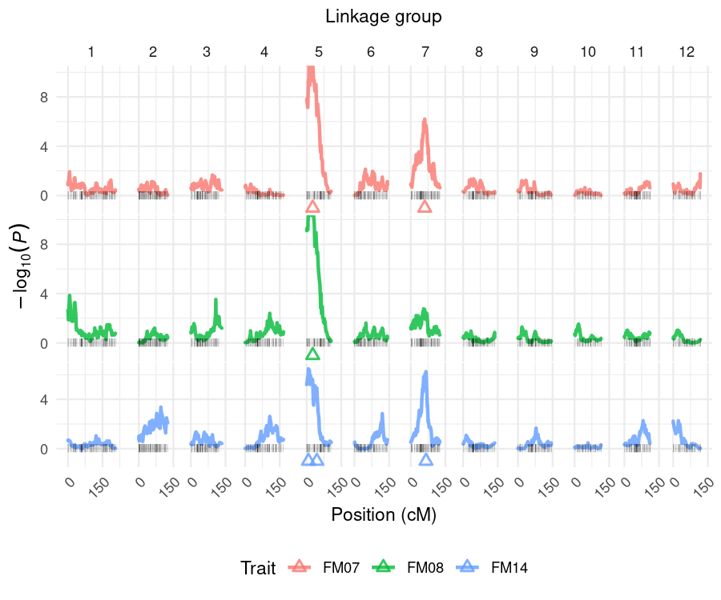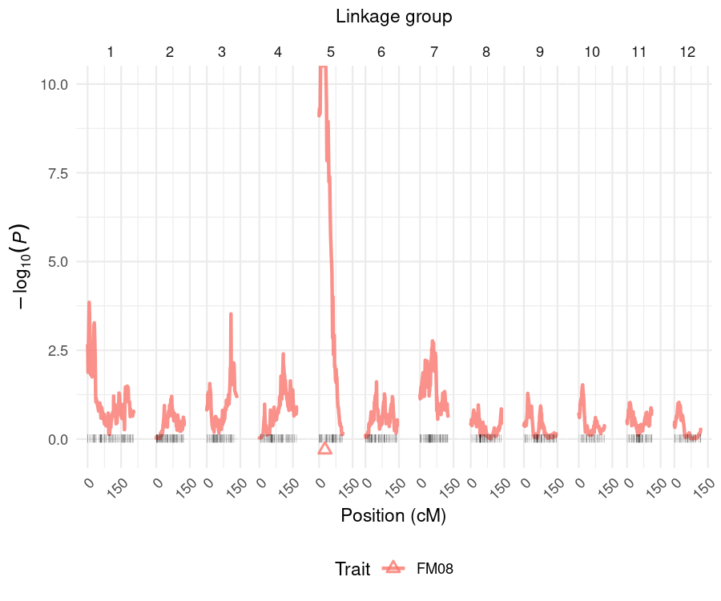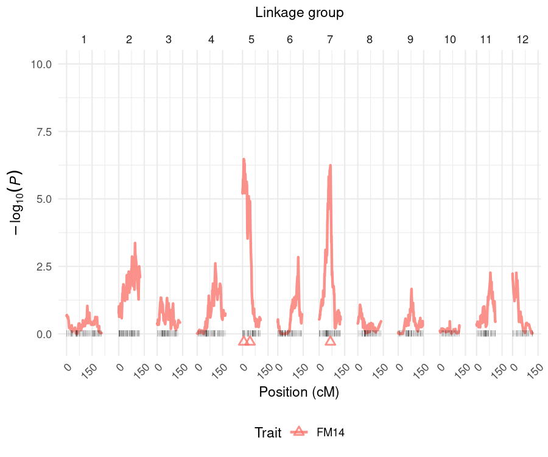

Triangles indicate the estimated position of the QTL peaks. By providing values to the y-axis limits using `ylim`, one guarantees that all plots will be in the same scale.

If one wants to plot some or all QTL profiles at once for comparison, `pheno.col` needs to be specified as a vector of numbers representing the phenotype columns. As default, `pheno.col = NULL` includes all evaluated traits:


```r
> plot_profile(data = data, model = remim.mod, grid = TRUE)
```

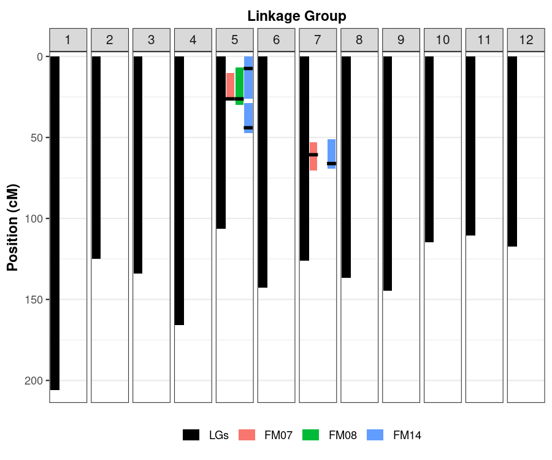

```r
> plot_profile(data = data, model = remim.mod, grid = FALSE)
```


The argument `grid` organizes the multiple plots as a grid if `TRUE`, or superimposed profiles if `FALSE`.

## Support intervals

You can visualize the QTL distributed along the linkage map, together with their supporting intervals with the function `plot_sint()`: 


```r
> plot_sint(data = data, model = remim.mod)
```


Notice that for highly significant QTL ($P < 2.22 \times 10^{-16}$), computing support intervals may need adjustment due to the floating point precision limit.

# Fit multiple QTL models

Once final models have been defined, one may use REML to estimate their parameters with the function `fit_model()`:


```r
> fitted.mod = fit_model(data = data, model = remim.mod, probs = "joint", polygenes = "none")
## There are 2 QTL in the model for trait 1 'FM07'. Fitting model... Done! 
## 
## There is 1 QTL in the model for trait 2 'FM08'. Fitting model... Done! 
## 
## There are 3 QTL in the model for trait 3 'FM14'. Fitting model... Done!
```

Here, we used the joint probabilities of the putative QTL genotypes (`probs= "joint"`), instead of the parent marginal ones (`probs = "marginal"`). The latter may be interesting if one of the parents seems to not contribute much for a specific QTL (because all QTL allele effects are about the same, for example). Also, if `polygenes = "none"`, all individual QTL have their variance component estimated. One may want to define `polygenes = "most"` if all but one QTL have to be combined as a polygenic effect, or `polygenes = "all"` if all QTL have to be combined as a polygenic effect. Finally, `keep = TRUE` (default) saves matrices used on the calculations and additional results from `sommer`. This is useful in case one wants to assess additional metrics there, such as standard errors from parameter estimates, for example.

A `summary()` function shows parameter estimates, together with the QTL heritabilities, computed from the variance component estimates:


```r
> summary(fitted.mod)
## This is an object of class 'qtlpoly.fitted'
## 
## * Trait 1 'FM07' 
##   LG   Pos Nmrk Intercept   Var(g)  Var(e)        h2
## 1  5 26.19  438        NA 344.8765      NA 0.5680876
## 2  7 60.68  641        NA 86.57081      NA 0.1426012
## 3 NA    NA   NA  72.92765       NA 175.636 0.7106888
## 
## * Trait 2 'FM08' 
##   LG   Pos Nmrk Intercept   Var(g)   Var(e)       h2
## 1  5 26.19  438  78.77196 1001.341 490.0927 0.671395
## 
## * Trait 3 'FM14' 
##   LG   Pos Nmrk Intercept   Var(g)   Var(e)        h2
## 1  5  7.42  427        NA   8.6028       NA 0.3129561
## 2  5 44.03  449        NA 2.917533       NA 0.1061352
## 3  7 66.12  645        NA 4.766193       NA 0.1733865
## 4 NA    NA   NA  90.49077       NA 11.20231 0.5924778
```

## Plot QTL

After models have been fitted, you can visualize a summary of QTL metrics with the function `plot_qtl()`:


```r
> plot_qtl(data = data, model = remim.mod, fitted = fitted.mod, drop.pheno = FALSE)
```


Dots are located on the respective chromosome positions of the QTL peaks. The dots' sizes correspond to the specific QTL heritability, while their colors correspond to the $P$-values, which may help to identify the most or the less significant QTL. `drop = FALSE` makes sure all traits are displayed, even if they do not had any QTL detected.

## Estimate allele effects

Additive effects contributing to the overall mean by each allele individually, as well as their combinations within each parent, may be computed using the function `qtl_effects()`:


```r
> est.effects = qtl_effects(ploidy = 4, fitted = fitted.mod)
## There are 2 QTL in the model for trait 1 'FM07'. Computing effects for QTL ... 438 ... 641. Done! 
## 
## There is 1 QTL in the model for trait 2 'FM08'. Computing effects for QTL ... 438. Done! 
## 
## There are 3 QTL in the model for trait 3 'FM14'. Computing effects for QTL ... 427 ... 449 ... 645. Done!
```

A `plot()` function allows the user to visualize these contributions graphically:


```r
> plot(est.effects)
```

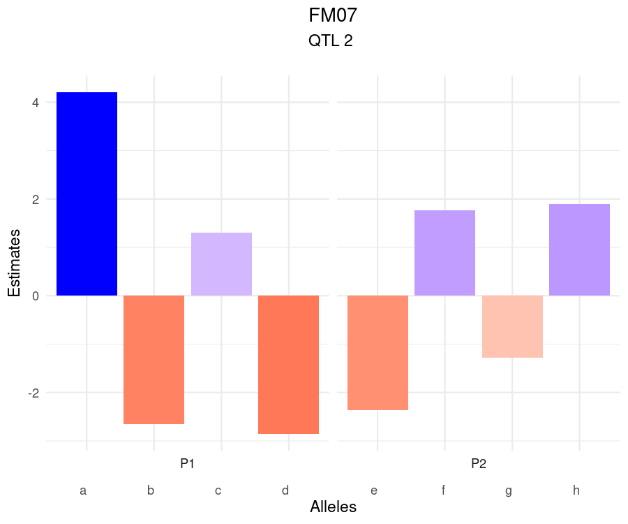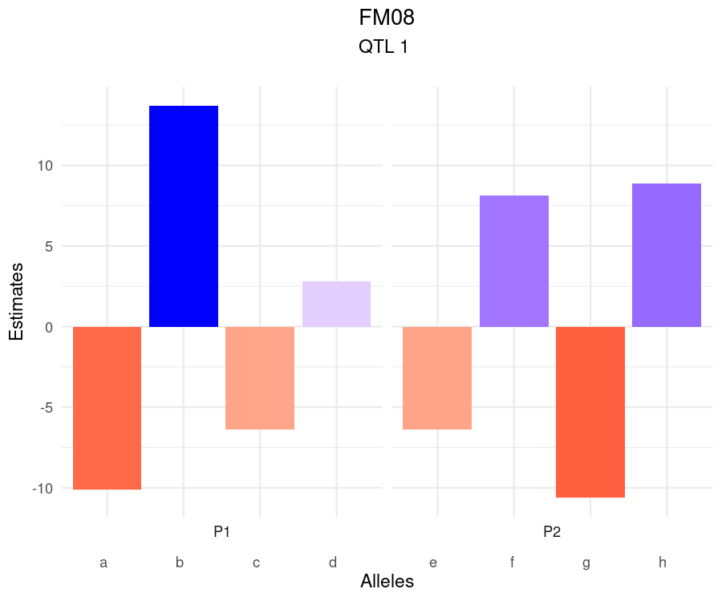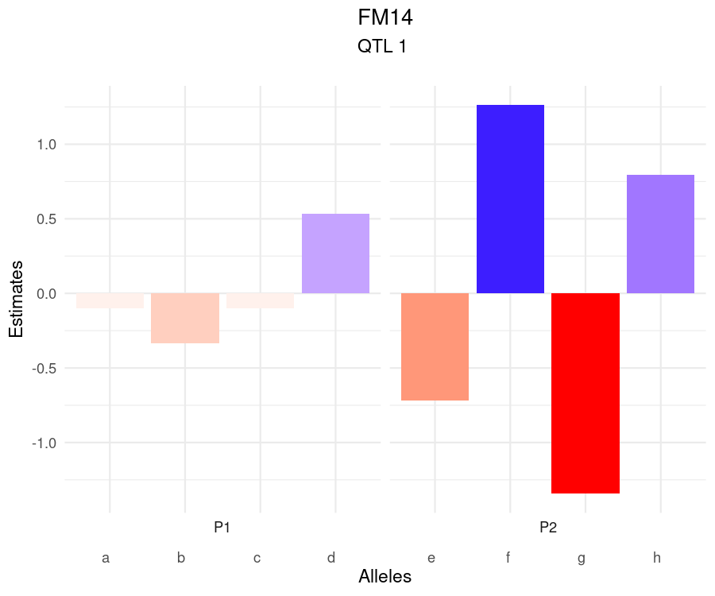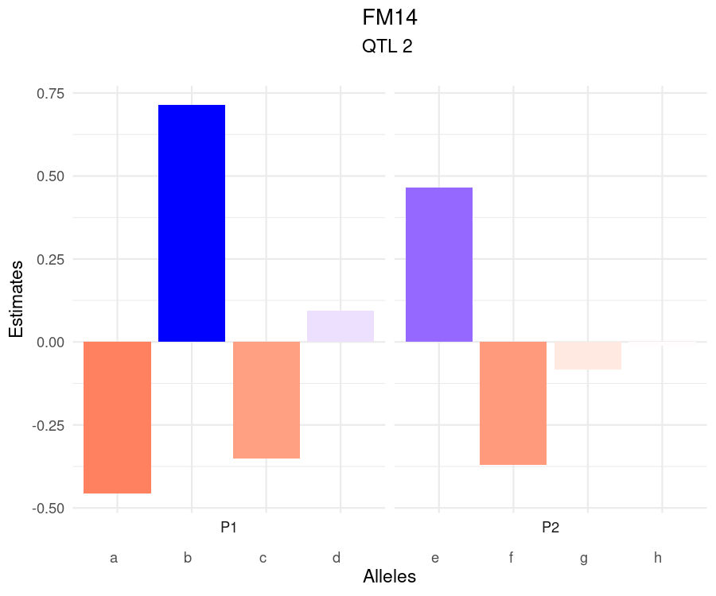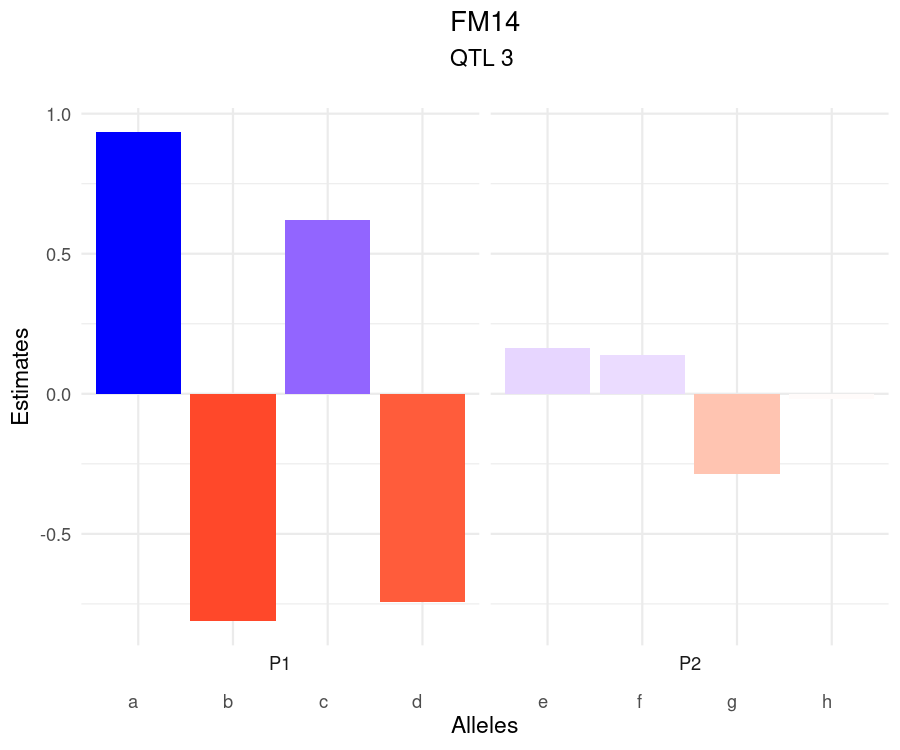

For each QTL, one can see which alleles contribute the most to increase or decrease the phenotypic mean. This is interesting to plan marker-assisted selection strategies, for example, as specific alleles can be selected based on the marker dosage at or around the QTL peak and with the support of the population linkage map from `mappoly`. 

<!-- For example, if one is interested in decreasing the value of the trait 'T17', the allele *i*, combined with *j* and *l* from the parent 'P2' must be targeted. On the other hand, the parent 'P1' does not seem to contribute much to the trait variation, although selecting for the alleles *b* through *e* must be the best way to achieve one's goal of decreasing the phenotypic value of 'T17'. -->

## Predict breeding values

Finally, with the estimates of the final models in hands, one can use them to perform predictions of the breeding values as follows:


```r
> y.hat = breeding_values(data = data, fitted = fitted.mod)
```

A `plot()` function shows the distribution of the genotypic values for the population:


```r
> plot(y.hat)
```

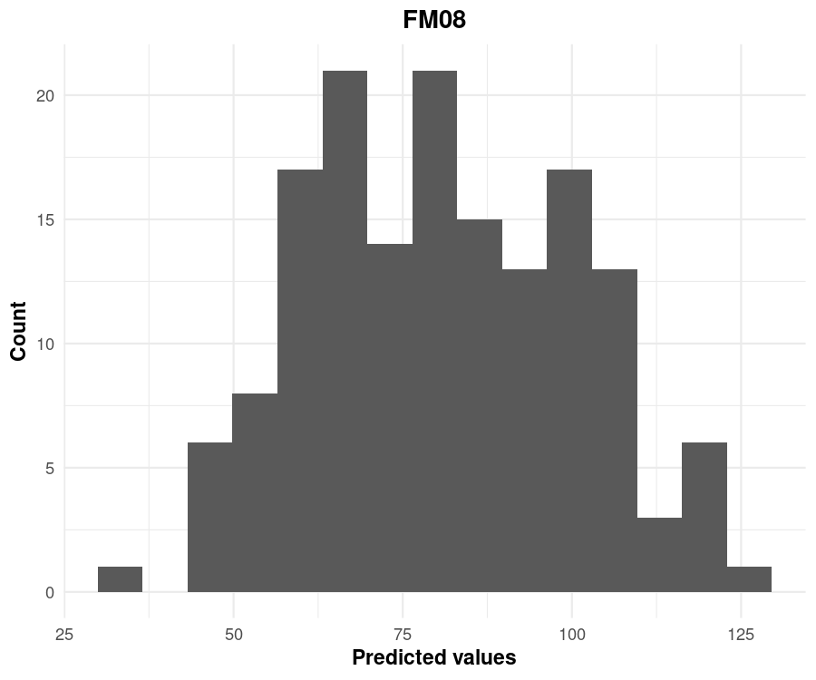

This may be interesting for those populations whose individuals have been genotyped, but not phenotyped, and you still want to consider them when selecting the best genotypes.

# Compare with a fixed-effect approach

A previous fixed-effect interval mapping (here named FEIM) model has been proposed as a first approach to map QTL in autopolyploid species [@Hackett2014]. It consists of a single-QTL model, where every position is tested according to the model:

$$Y = \mu_C + \sum_{i=2}^{m} \alpha_i X_i + \sum_{i=m+2}^{2m} \alpha_i X_i$$

where $\mu_C$ is the intercept, and $\alpha_i$ and $X_i$ are the main effects and indicator variables for allele $i$, respectively, and $n$ is the ploidy level. The constraints $\alpha_{1} = 0$ and $\alpha_{m+1} = 0$ are imposed to satisfy the condition $\sum_{i=1}^m X_i = m/2$ and $\sum_{i=m+1}^{2m} X_i = m/2$, so that $\mu_C$ is a constant hard to interpret due to these constraints. Notice that the higher the ploidy level, the more effects have to be estimated, i.e., tetraploid models have six main effects, hexaploid models have 10 effects, octoploid models will have 14 effects (i.e. $2m-2$), and so on.

Different from REMIM (where we test the variances), here the interest is to know if the average allele effects are different from zero (the null hypothesis) using likelihood-ratio tests (LRT). Commonly, the tests are presented as "logarithm of the odds" (LOD scores), where $LOD = \frac{LRT}{2 \times \log_e(10)}$.

In order to evaluate significance (declare a QTL), empirical LOD thresholds are computed for each trait using permutations as proposed by @Churchill1994a. 

## LOD threshold permutations

Using the same object `data` from REMIM analyses, one can first compute the thresholds for all or specific traits. The number of simulations is given by `n.sim`, and 1,000 permutations are generally used:


```r
> perm = permutations(data = data, n.sim = 1000, n.clusters = 4)
## INFO: Using 4 CPUs for calculation
## 
## Permutations for trait 1 'FM07' 
##   95% LOD threshold = 5.9
##   Calculation took 333.23 seconds
## 
## Permutations for trait 2 'FM08' 
##   95% LOD threshold = 6
##   Calculation took 277.44 seconds
## 
## Permutations for trait 3 'FM14' 
##   95% LOD threshold = 5.99
##   Calculation took 287.11 seconds
```

Once the analyses are done, one may print the results by specifying a vector with the probabilities of interest. By default, `probs = c(0.95, 0.90)`, so that 95% and 90% quantiles are shown:


```r
> print(perm)
## This is an object of class 'qtlpoly.perm'
## 
## * Trait 1 'FM07' 
##  90%  95% 
## 5.55 5.90 
## 
## * Trait 2 'FM08' 
##  90%  95% 
## 5.63 6.00 
## 
## * Trait 3 'FM14' 
##  90%  95% 
## 5.54 5.99
```

As `probs = c(0.95, 0.90)` were also the default in `permutations()` function, we already stored the genome-wide significance LOD threshold for 0.05 and 0.10 levels, respectively. In order to use the 95% quantiles in the subsequent FEIM analyses, one can do:


```r
> (sig.lod = perm$sig.lod$`0.95`)
## FM07.95% FM08.95% FM14.95% 
## 5.903135 6.004204 5.985607
```

## Interval mapping

`feim` function tests every position from the specified step size from `data` - here, every 1 cM. Besides the `sig.lod` vector containing the thresholds for each trait, one needs to provide a window size (e.g., `w.size = 15`), which will be used to select QTL peaks within the same linkage group with a minimum distance of the given window size:


```r
> feim.mod = feim(data = data, w.size = 15, sig.lod = sig.lod)
## FEIM for trait 1 'FM07' 
##   QTL was found on LG 5 at 26.19 cM (position number 438)
##   QTL was found on LG 7 at 56.07 cM (position number 637)
## 
## FEIM for trait 2 'FM08' 
##   QTL was found on LG 5 at 26.19 cM (position number 438)
## 
## FEIM for trait 3 'FM14' 
##   QTL was found on LG 5 at 26.19 cM (position number 438)
## 
## Calculation took 5.19 seconds
```

A `print` function shows detailed information on the detected QTL:


```r
> print(feim.mod)
## This is an object of class 'qtlpoly.feim'
## 
## * Trait 1 'FM07' 
##   LG   Pos Nmrk      Mrk   LRT   LOD     AdjR2
## 1  5 26.19  438 c2_22986 88.75 19.27 0.4432602
## 2  7 56.07  637 c2_23097 35.67  7.75 0.1887396
## 
## * Trait 2 'FM08' 
##   LG   Pos Nmrk      Mrk   LRT   LOD     AdjR2
## 1  5 26.19  438 c2_22986 96.57 20.97 0.4685352
## 
## * Trait 3 'FM14' 
##   LG   Pos Nmrk      Mrk   LRT   LOD     AdjR2
## 1  5 26.19  438 c2_22986 49.62 10.78 0.2667912
```

Remember that in this case, one should not sum adjusted $R^2$ for the same trait, as each one was obtained from a single-QTL model (i.e., not estimated conditional to the others).

Finally, one may want to plot the profiles and compare to the [plot profiles] from REMIM:


```r
> plot_profile(data = data, model = feim.mod, grid = TRUE)
```

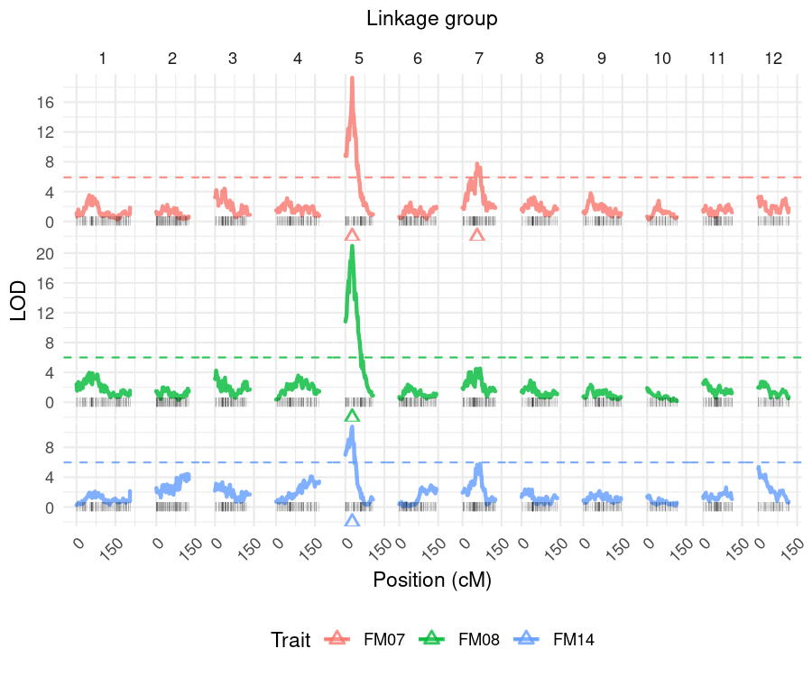

<!-- Notice that one QTL on LG 1 was not detected for the trait 'T32' (false negative), while one QTL on LG 3 for the trait 'T45' was wrongly assigned (false positive). This exemplifies the power of multiple-QTL models over the single-QTL ones. Therefore, the FEIM model may be recommended only as a first, quick approach, but not as the ultimate model for detecting QTL in autopolyploid species.  -->

# Exporting to VIEWpoly

One can export the results from `MAPpoly` and `QTLpoly` to visualize them in the R package `VIEWpoly` with the commands below:


```r
> save(maps4x, file = "mappoly.maps.RData")
> save(data, file = "qtlpoly.data.RData")
> save(remim.mod, file = "qtlpoly.remim.mod.RData")
> save(fitted.mod, file = "qtlpoly.fitted.mod.RData")
> save(est.effects, file = "qtlpoly.est.effects.RData")
```

# Acknowledgments

This package has been developed as part of the [Genomic Tools for Sweetpotato Improvement](https://sweetpotatogenomics.cals.ncsu.edu/) (GT4SP) and [SweetGAINS](https://cgspace.cgiar.org/handle/10568/106838) projects, both funded by [Bill \& Melinda Gates Foundation](https://www.gatesfoundation.org/).

# References

